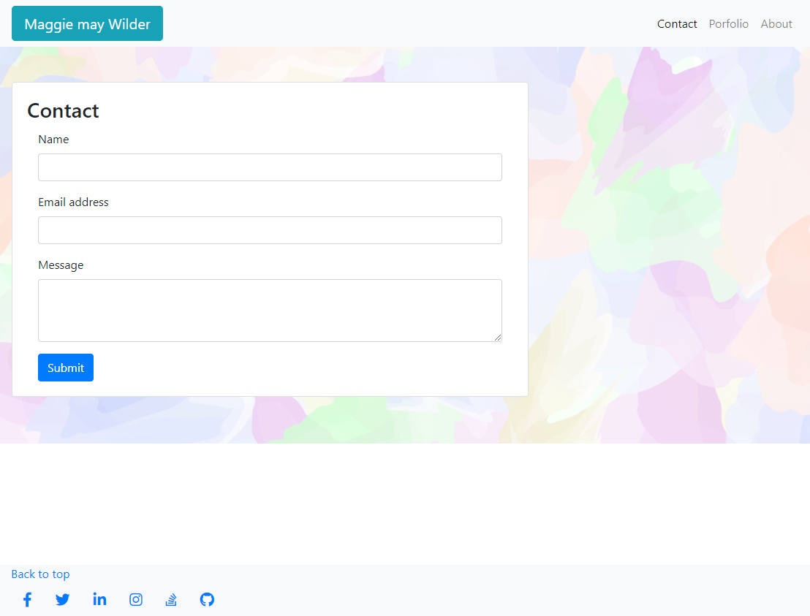
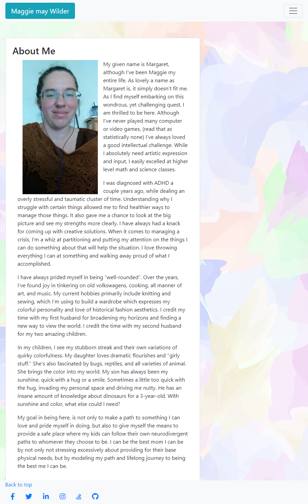
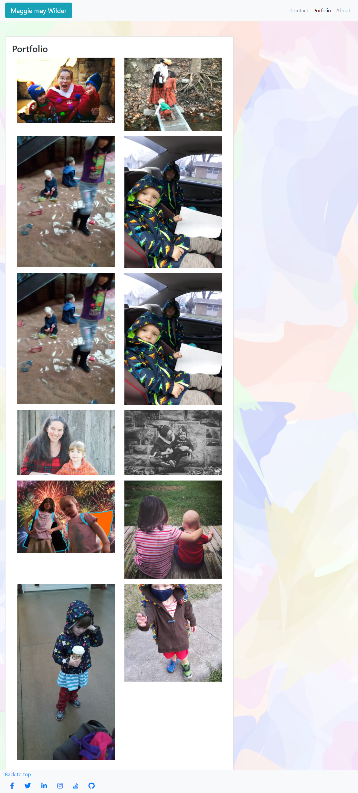

# My Responsive Portfolio

KU bootcamp week two homework: Using bootstrap to generate a responsive portfolio. 

I thoroughly enjoyed, yet struggled with this process. It felt like trying to get somewhere while the walls kept changing, although I realize my slippery grasp of bootstrap to start with probably contributed to if not completely created that illusion. I could have spent days digging through the bootstrap documentation investigating what this class does and how to properly implement that element.

As of submission, I would like for my images to be more responsive with screen size. It is something I still need to figure out. I'm also realizing with the feedback from my last assignment that I need to put more concious effort into adding quality comments to document the process. I also wish I'd had more time and availability to check and verify functionality of social media links from another device that doesn't have my login information saved, however global pandemic and access to resources is sometimes a mite scarce.

## Credits

(Chris Dixon)[https://chrisdixon.dev/] for general information and tutorials
(Material Design for Bootstrap)[https://mdbootstrap.com/docs] for background image and social media buttons.
